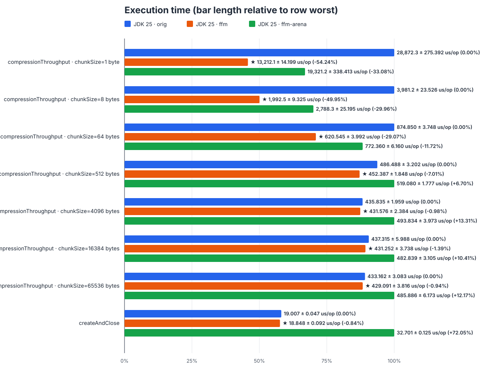
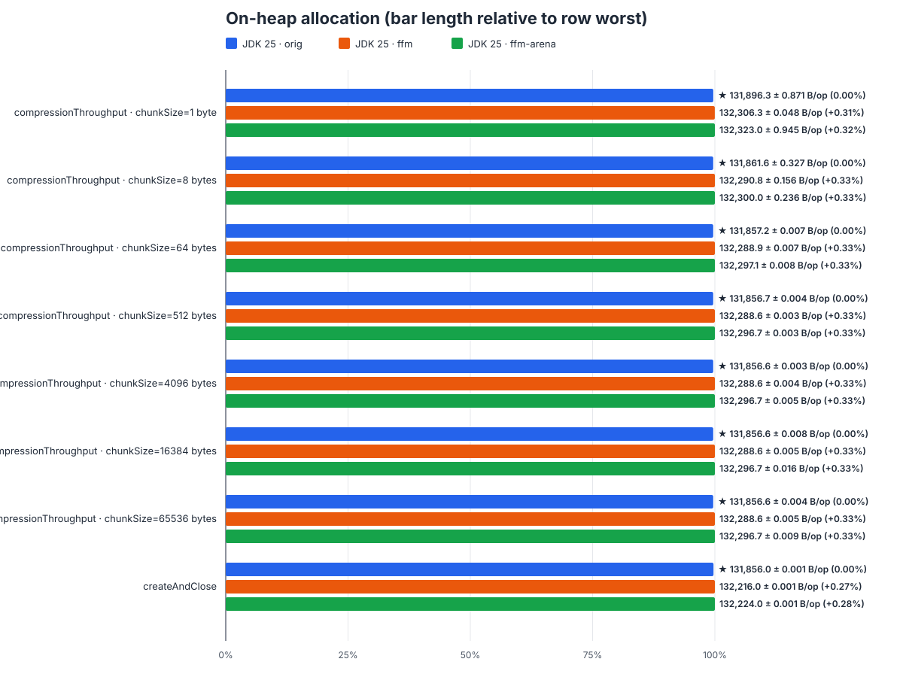
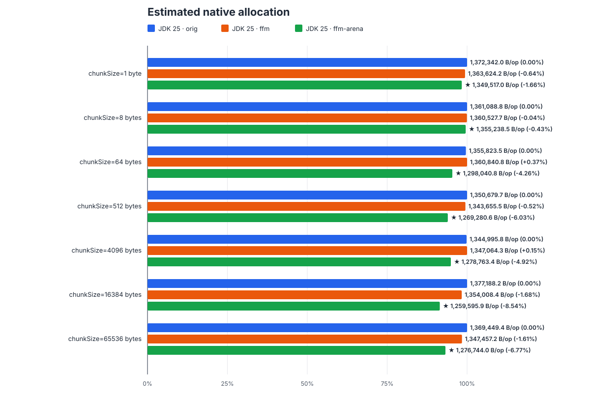

# ZstdOutputStreamNoFinalizerBenchmark benchmark comparison — JDK 25

Implementations: `orig` — zstd-jni `1.5.7-16`; `ffm` — branch [support-ffm-api-v1](https://github.com/zygiert1990/zstd-jni/tree/support-ffm-api-v1); `ffm-arena` — branch [support-ffm-api-v1-arena](https://github.com/zygiert1990/zstd-jni/tree/support-ffm-api-v1-arena).

Input file: **223,634 bytes**.

Benchmark host: **Ubuntu 22.04.5 LTS** (amd64); **Intel Core i5-8500 @ 3.00 GHz**, 6 physical / 6 logical CPU cores; **16 GB RAM**.

Every JDK 25 implementation is shown. Bar lengths are proportional to the measured value within each workload row, with the worst result as the longest bar. Labels show the absolute value and change versus JDK 25 `orig`; negative percentages mean less execution time or allocation and are better.

